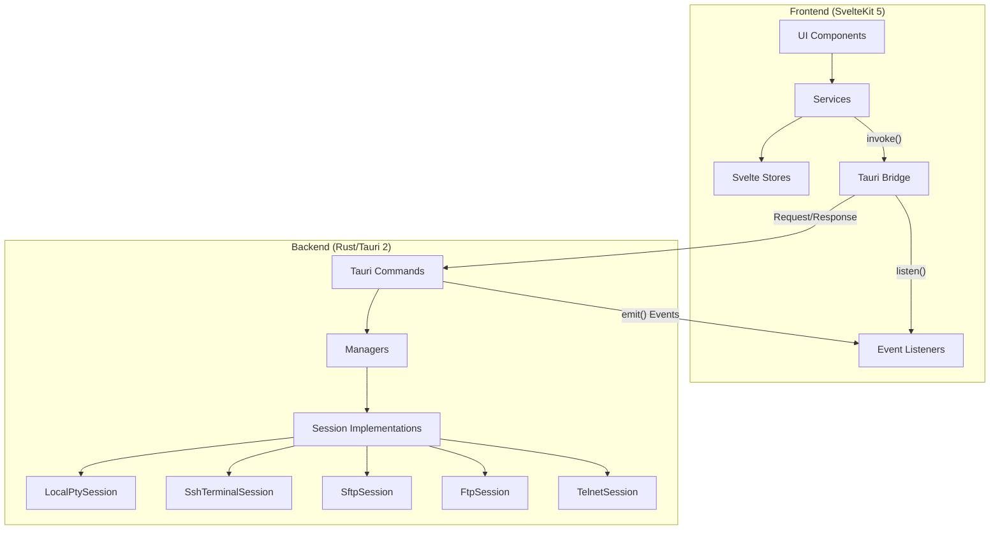
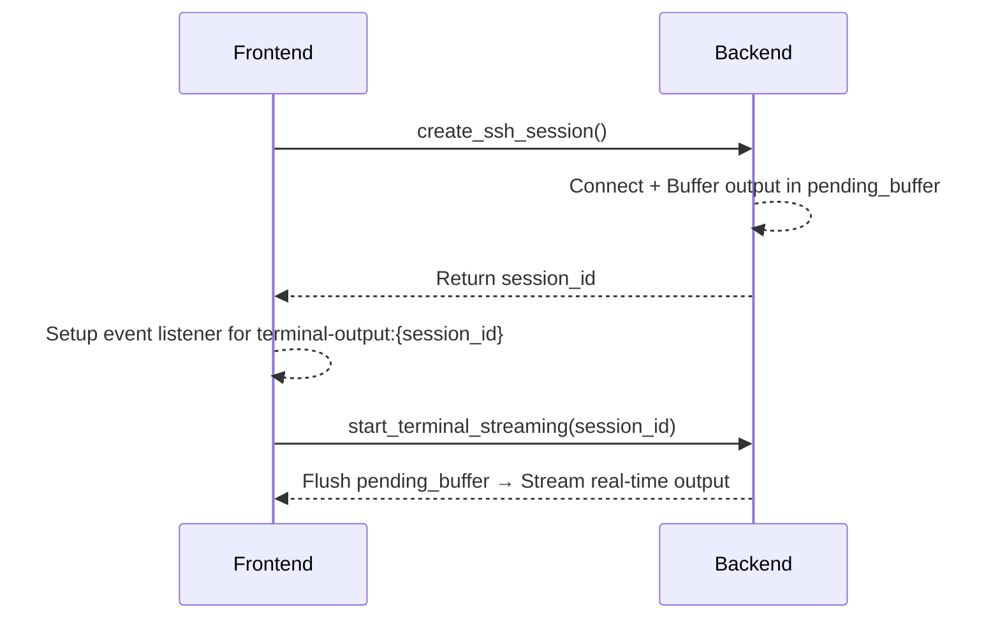
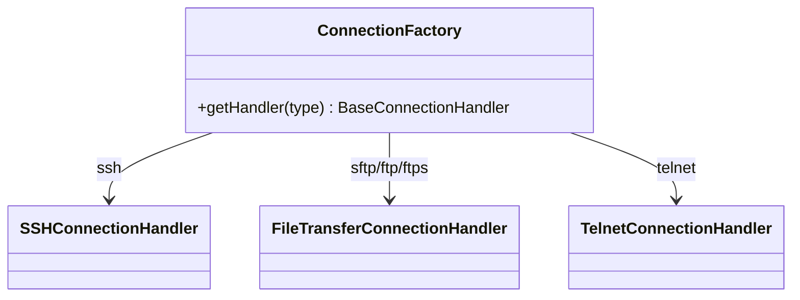
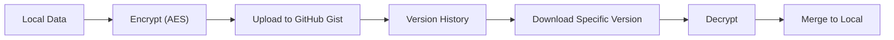
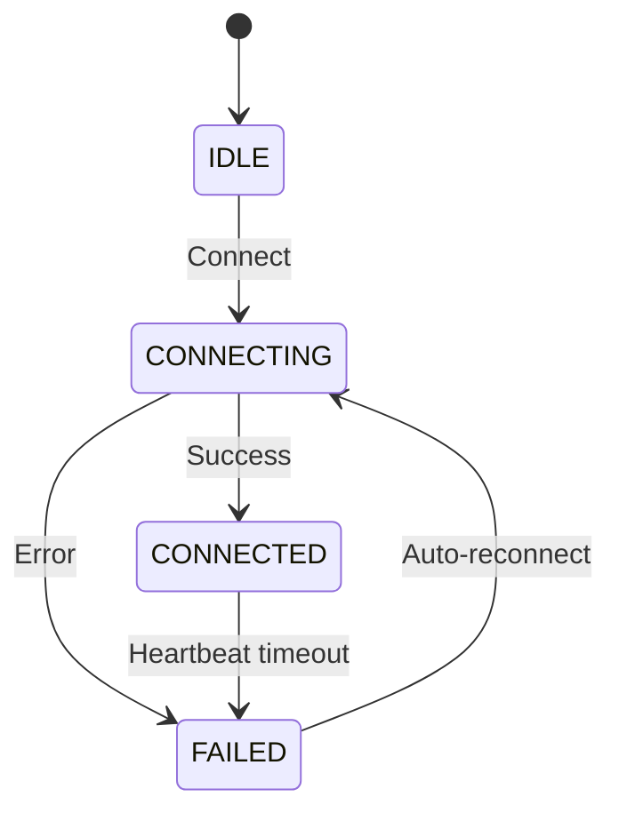

# Rermius Business Logic

## Overview

**Rermius** is a desktop SSH terminal management application built with **Tauri 2** (Rust backend) + **SvelteKit 5** (JS frontend). It supports terminal emulation, SSH/Telnet connections, SFTP/FTP file transfers, workspace organization, and cloud sync.

---

## Architecture

**Data Flow:**  
`User Action → Service → invoke() → Rust Command → Manager → Session`  
`← emit() Event → Store Update → UI Re-render`

---

## 1. Terminal Management

### Connection Types
| Type | Backend | Auth | Protocol |
|------|---------|------|----------|
| Local | `LocalPtySession` (portable-pty) | None | Native shell |
| SSH | `SshTerminalSession` (russh) | Password / SSH Key | SSH protocol |
| Telnet | `TelnetSession` | Username/Password | Telnet protocol |

### Two-Phase SSH Initialization (Race Condition Prevention)

### SSH ProxyJump (Chain of Responsibility)

Connects through multiple jump hosts using the **TCP Bridge Pattern**:

1. `HopHandler.from_config()` – builds chain from config
2. `HopHandler.execute()` – recursively connects through each hop
3. Each hop: spawn local TCP listener → bridge SSH channel I/O → connect SSH through localhost
4. Emits `ssh-chain-progress` events for frontend progress display

**Files:** `src-tauri/src/ssh/chain.rs`, `src/lib/services/connection/ssh.js`

### Session Lifecycle

- **TerminalManager** (singleton via Tauri `.manage()`) – manages all sessions in `Arc<RwLock<HashMap>>`
- Supports: `write`, `resize`, `close`, `ping` (keepalive check), `execute_command`
- Frontend uses **xterm.js** via composable `src/lib/composables/useXtermTerminal.svelte.js`

### Heartbeat & Auto-Reconnect

- **Heartbeat**: Pings every 30s, timeout 10s, 2 consecutive failures → connection dead
- **Auto-Reconnect**: Loop-based retry with exponential backoff (5s → 60s max), cancellable, network-state aware

**Files:** `src/lib/services/connection/heartbeat.js`, `src/lib/services/connection/auto-reconnect.js`

---

## 2. File Transfer (SFTP/FTP)

### Architecture

Core trait `FileTransferSession` (`src-tauri/src/core/session.rs`) with 3 implementations:

| Impl | Library | Features |
|------|---------|----------|
| `SftpSession` | russh-sftp | Shares SSH handle, chmod, streaming I/O |
| `FtpSession` | suppaftp | FTPS support via async-rustls |
| Local FS | Tauri plugin-fs | Windows drive enumeration |

### File Operations (15+ operations)

- **CRUD**: list, create dir, delete, rename
- **Transfer**: download/upload with progress (UUID-based `transferId`)
- **Advanced**: copy, move (both local & remote), chmod (SFTP only), stat, read/write content
- **Duplicate handling**: Auto-renames files with "(N)" suffix

### Lock-Free Transfer Pattern (SFTP)
Get file handle (brief lock) → drop lock → stream data without blocking other operations.

### Frontend Dual-Panel
- Left: Local filesystem (Windows drive enumeration at root "/")
- Right: Remote (SFTP/FTP)
- Drag-and-drop, context menus, progress bars with cancel

**Files:** `src-tauri/src/managers/transfer.rs`, `src/lib/services/files/browser.js`

---

## 3. Connection Factory (Strategy Pattern)

Each handler is responsible for: `canHandle()`, `connect()`, `disconnect()`, `reconnect()`.

**File:** `src/lib/services/connection/factory.js`

---

## 4. Data Management (Local-First)

All data is stored locally at `appDataDir/workspaces/{workspaceId}/`:

| Data | File | Key Features |
|------|------|-------------|
| Hosts | `hosts.json` | CRUD, groups, tags, colors, default settings |
| Keychain | `keychain.json` | SSH keys (RSA/Ed25519/ECDSA), vaults, import/export, duplicate detection |
| Snippets | `snippets.json` | Command snippets, labels, click count tracking |
| Sync Settings | `sync-settings.json` | GitHub Gist sync config |

### Host Management
- **Host fields**: hostname, port, username, authMethod, keyId, password, proxyJump, connectionType, color, tags
- **Groups**: Organize hosts by groups; deleting a group moves hosts to ungrouped
- **Deduplication**: Label uniqueness check

### SSH Keychain
- **Key types**: RSA, ED25519, ECDSA, DSA, PKCS8, OpenSSH
- **Import**: From file, auto-detect type & size, duplicate detection by fingerprint
- **Security**: Keys encrypted in storage, temp files for backend (auto-cleanup after 2s)
- **Vaults**: Organizational grouping

**Files:** `src/lib/services/data/hosts.js`, `src/lib/services/data/keychain.js`, `src/lib/services/data/snippets.js`

---

## 5. Workspace System

Each workspace contains isolated data (hosts, keychain, snippets, sync settings).

- **CRUD**: create, update, delete (with directory cleanup)
- **Avatar**: Upload/delete workspace avatar image
- **Default workspace**: Auto-created on first launch (`isFirstLaunch()`)
- **Current workspace**: Tracked in `localStorage` + metadata file

**File:** `src/lib/services/data/workspaces.js`

---

## 6. Cloud Sync (GitHub Gist)

### Sync Flow

- **Upload**: Encrypt data parts → create/update Gist
- **Download**: Fetch Gist → decrypt → merge
- **Version History**: Browse Gist commit history with pagination
- **Selective Sync**: Choose which parts to sync (profiles, bookmarks, settings, commands, keychain)
- **Validation**: Verify GitHub token + Gist access before sync

**File:** `src/lib/services/sync/settings.js`

---

## 7. Tab & UI State Management

### Tab Types & States

| Tab Type | Description |
|----------|-------------|
| `home` | Landing page |
| `terminal` | SSH/Local/Telnet terminal |
| `file-browser` | FTP/FTPS file browser |

- **Tab features**: Reorder (drag-drop), unique labels, host config storage for reconnect
- **Split view**: Terminal tab can show file manager alongside

**Files:** `src/lib/stores/tabs.store.js`, `src/lib/stores/status-bar.js`

---

## 8. Additional Features

| Feature | Description | Key File |
|---------|-------------|----------|
| SSH Config Import | Scan `~/.ssh/config` | `src/lib/composables/useSSHConfigScan.svelte.js` |
| Keyboard Shortcuts | Global shortcuts | `src/lib/services/utils/keyboard-shortcuts.js` |
| Shell Detection | Detect available shells | `src-tauri/src/pty/shell.rs` |
| File Watcher | Watch file changes | `src-tauri/src/file_watcher/` |
| Theme System | Dark theme, CSS variables | `src/lib/stores/theme.store.js` |
| Auto Update | App update checker | `src/lib/stores/update.store.js` |
| Network Monitor | Online/offline detection | `src/lib/services/infra/network-state.js` |
| IME Support | Vietnamese/Chinese/Japanese input | `src/lib/composables/useXtermTerminal.svelte.js` |

---

## Design Patterns Summary

| Pattern | Where Used |
|---------|-----------|
| **Strategy** | `TerminalSession` trait, `FileTransferSession` trait |
| **Factory** | `ConnectionFactory` → handlers by type |
| **Singleton** | `TerminalManager`, `FileTransferManager`, `ConnectionHeartbeatManager` |
| **Chain of Responsibility** | `HopHandler` for SSH ProxyJump |
| **Facade** | Frontend services abstract Tauri `invoke()` calls |
| **Observer/Pub-Sub** | Tauri events (terminal output, transfer progress, chain progress) |
| **Two-Phase Init** | SSH session creation to prevent race conditions |
